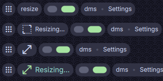

# HyprlandSubmapIndicator



Customizable [Hyprland submap](https://wiki.hypr.land/Configuring/Basics/Binds/#submaps) indicator statusbar widget for [DankMaterialShell](https://danklinux.com)

## Table of Contents

- [Features](#features)
- [Install](#install)
- [Configuration](#configuration)
- [Troubleshooting](#troubleshooting)
- [License](#license)

## Features

- **Self-hiding indicator** - A bar widget that appears automatically when any Hyprland submap is active with a hide/show animation using system settings.
- **Customizable icon** - Optionally display an icon next to the label, with a configurable default icon and per-submap overrides.
- **Customizable label** - Show the submap name with adjustable color and font size. Or hide the label entirely for an icon-only indicator.
- **Per-submap appearance tweaks** - Override the label text, text color, icon and/or icon color for individual submaps.
- **Click to reset** - Optionally click the indicator to reset the submap
- **Legacy Hyprland support** - Supports both legacy Hyprlang and modern Lua Hyprland configurations.

## Install

### Using Settings

- Open **DMS Settings -> Plugins -> Browse**
- Enable **Third-party plugins**
- Search for **Hyprland Submap Indicator** and **Install**

### Using DMS CLI

```sh
dms plugins install hyprlandSubmapIndicator
```

### Manually

1. Clone or download this repository.
2. Copy or symlink the `HyprlandSubmapIndicator` directory into to `~/.config/DankMaterialShell/plugins/`.
3. Open **DMS Settings -> Plugins -> Scan for Plugins**.
4. Enable **Hyprland Submap Indicator** and add it to your Dank Bar layout.

## Configuration

Open **DMS Settings -> Plugins -> Hyprland Submap Indicator** to configure the widget.

### Behavior

| Setting | Description | Default |
|---------|-------------|---------|
| **Click to reset** | Clicking the indicator dispatches a command to reset the submap. | `true` |

### Label appearance

| Setting | Description | Default | Options |
|---------|-------------|---------|---------|
| **Font size** | Size of the submap label text. | `Small` | `None (Icon only)`, `Small`, `Medium`, `Large`, `X-Large` |
| **Default text color** | Global color for the label. | `#00000000` (Uses theme color) | |

#### Submap labels

Override the label text and/or color for individual submaps.

| Field | Description |
|-------|-------------|
| **Submap** *(required)* | The exact Hyprland submap name to match. |
| **Label** *(optional)* | Custom text to display instead of the submap name. Leave blank keep the original name and only assign a color. |
| **Color** *(optional)* | A custom label color. A hexadecimal color string (e.g., `#F38BA8`, `#F38BA8E0`) or [color name](https://www.w3.org/TR/SVG11/types.html#ColorKeywords). Leave blank to use the default text color. |

### Icon appearance

| Setting | Description | Default |
|---------|-------------|---------|
| **Default icon** | [Material Icon](https://fonts.google.com/icons) name displayed by default (e.g., `layers`, `open_in_full`, `keyboard`). | *(blank)* (Icon disabled) |
| **Inherit label color** | When enabled, the icon uses the same color as the label. | `true` |
| **Default icon color** | Global color for the icon. This option is ignored when **Inherit label color** is enabled. | `#00000000` (Uses theme color) |

#### Submap icons

Override the icon and/or color for individual submaps.

| Field | Description |
|-------|-------------|
| **Submap** *(required)* | The exact Hyprland submap name to match. |
| **Icon** *(optional)* | A [Material Icon](https://fonts.google.com/icons) name to display instead of the default. Leave blank to only assign a color. |
| **Color** *(optional)* | A custom icon color. Hexadecimal color string (e.g., `#F38BA8`, `#F38BA8E0`) or [color name](https://www.w3.org/TR/SVG11/types.html#ColorKeywords). Leave blank to use the default icon color. |

## Troubleshooting

**Custom labels or colors aren't applying**
- For per-submap overrides, double-check that the **Submap** field exactly matches the name defined in your Hyprland config.
- For colors, make sure the color is a valid color name or hexadecimal color string

**Icons aren't working**
- Make sure you're using a `snake_case` formatted icon name. New and recently-added Material Icons might not be available.

## License

MIT
